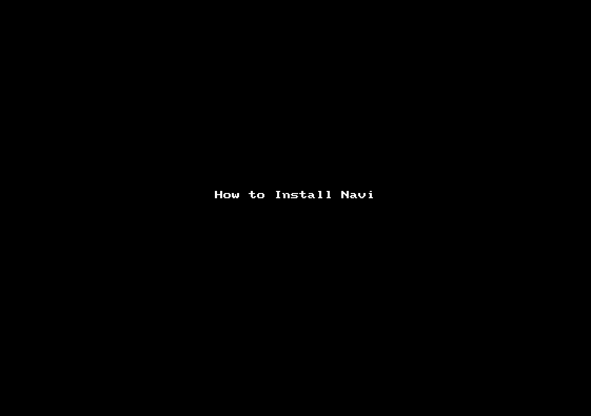
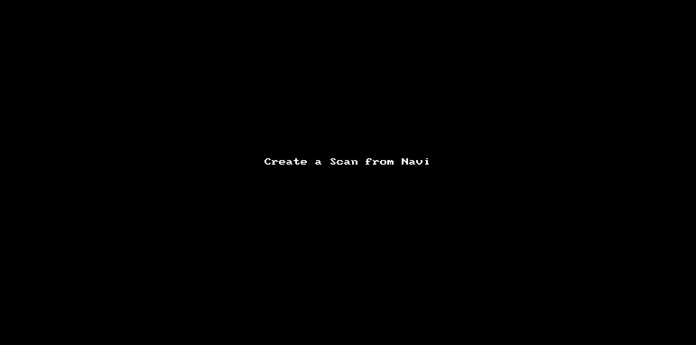
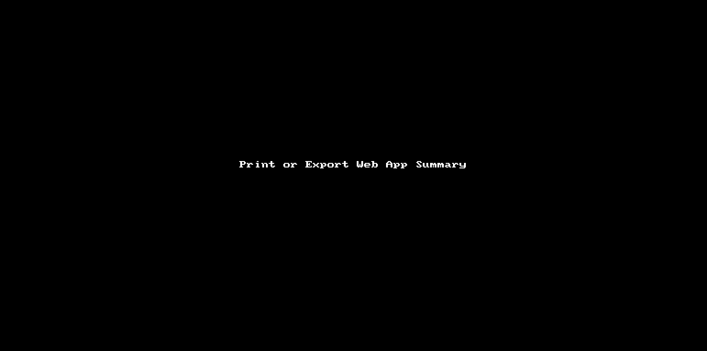

# Install Navi using Pip

# Create a Config (Scan Policy) from the Command-line

# Create 100s of Configs (Scan Policies) from a CSV of FQDNs

# Confirm the Creation of the Configs

# Discover Statistics and Scan Details

